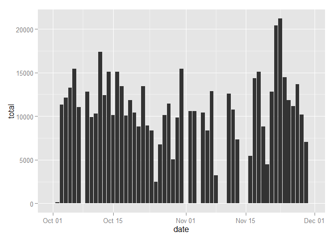
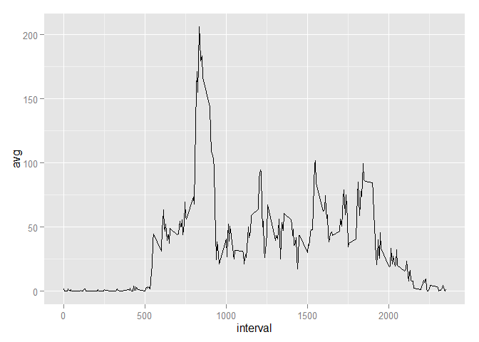
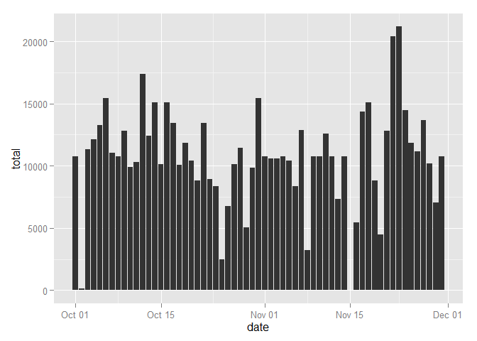

# Reproducible Research: Peer Assessment 1
Amine BENHAMZA  

### Librairies to install
Before going further, please ensure that you installed the following librairies:
`dplyr`
`ggplot2`


### Loading and preprocessing the data
Unzip the compressed file and apply the specific function `read.csv`

```r
activity <- read.csv("activity.csv")
```


### What is mean total number of steps taken per day?

Prepare data in order to generate histogram and to answer the question


```r
suppressMessages(suppressWarnings(library(dplyr)))

#Build dateframe total of steps
act_total <- activity %>%  
             group_by(date) %>% 
             summarise(total = sum(steps,na.rm=TRUE))

#Convert dates
act_total$date <- as.Date(act_total$date)
```

Histogram of total steps per day


```r
suppressMessages(suppressWarnings(library(ggplot2)))

#Plot Data Frames
m <- ggplot(act_total, aes(x=date,y=total))
m <- m + geom_histogram(stat="identity")
m
```

 

Median of the total number of steps taken per day

```r
median(act_total$total,na.rm=TRUE)
```

```
## [1] 10395
```

Mean of the total number of steps taken per day

```r
mean(act_total$total,na.rm=TRUE)
```

```
## [1] 9354.23
```

### What is the average daily activity pattern?
Prepare data in order to plot the time series and to answer the question

```r
#Build dateframe
act_avg <- activity %>%  
           group_by(interval) %>% 
           summarise(avg = mean(steps,na.rm=TRUE)) 
```

Plot the time series

```r
#Plot Data Frames
m <- ggplot(act_avg, aes(x=interval,y=avg))
m <- m + geom_line()
m
```

 

The 5-minute interval that contains on average the maximum number of steps

```r
head(arrange(act_avg,desc(avg)),1)$interval
```

```
## [1] 835
```

### Imputing missing values

Count of incomplete cases

```r
sum(!complete.cases(activity$steps)) 
```

```
## [1] 2304
```

Missing values will be filled with the average of averages per 5-minutes interval

```r
index <- !complete.cases(activity$steps)

activity_2 <- activity

activity_2[index,]$steps <- mean(act_avg$avg)
```

```r
act_total_2 <- activity_2 %>%  
               group_by(date) %>% 
               summarise(total = sum(steps,na.rm=TRUE))

#Convert dates
act_total_2$date <- as.Date(act_total_2$date)
```

Histogram of total steps per day


```r
#Plot Data Frames
m <- ggplot(act_total_2, aes(x=date,y=total))
m <- m + geom_histogram(stat="identity")
m
```

 

Median of the total number of steps taken per day

```r
median(act_total_2$total,na.rm=TRUE)
```

```
## [1] 10766.19
```

Mean of the total number of steps taken per day

```r
mean(act_total_2$total,na.rm=TRUE)
```

```
## [1] 10766.19
```

One can notice a drop in the mean and median, and because of the devised strategy for filling values, mean and median are equal.

### Are there differences in activity patterns between weekdays and weekends?
To be completed
